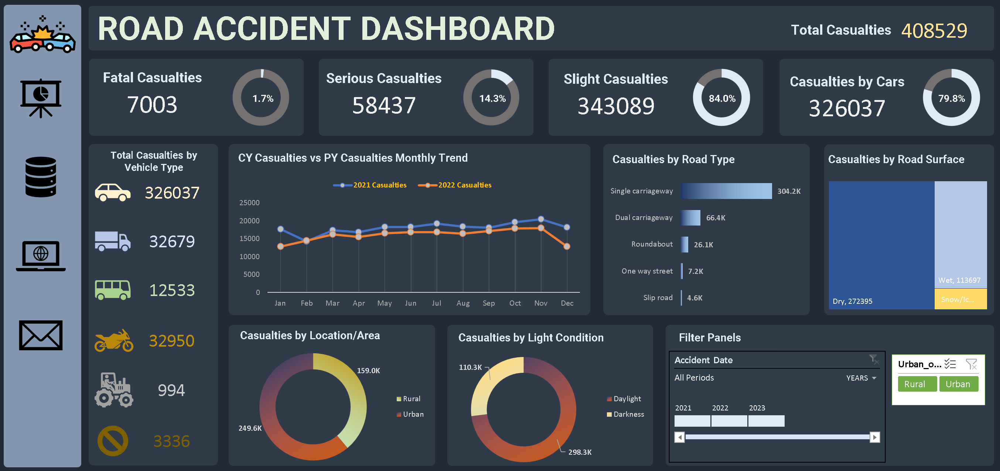

# 🚧 Road Accident Data Analysis Dashboard

This project focuses on analyzing road accident data to extract key insights and visualize trends related to accident severity, vehicle type, road conditions, and time of occurrence. The final output is a fully interactive dashboard providing data-driven support for policy recommendations and road safety improvements.

---

## 🧭 Objective

The main objective is to analyze the **total number of casualties** from road accidents and explore different dimensions such as accident severity, vehicle type, road surface, and time of day. The insights are presented through a detailed dashboard.

---

## 🎯 Key Performance Indicators (KPIs)

### ✅ Primary KPIs:
- Total **Casualties** reported after accidents.
- Total Casualties **by Accident Severity** and their **percentage** contribution.
- Maximum Casualties **by Vehicle Type**.

### ✅ Secondary KPIs:
- Total Casualties **by Vehicle Type**.
- **Monthly trend** comparison of casualties (Current Year vs Previous Year).
- **Maximum Casualties by Road Type**.
- Casualties **distribution by Road Surface** condition.
- **Day/Night** and **Location/Area-wise** relationship with total casualties.

---

## 🛠️ Process Followed

1. **Data Cleaning**  
   - Handled missing and inconsistent values  
   - Standardized date, time, and categorical entries  

2. **Data Processing**  
   - Created additional calculated columns where necessary  
   - Filtered out non-relevant records

3. **Data Analysis**  
   - Built **Pivot Tables** and **Filter Panels** for exploration  
   - Applied conditional formatting and calculations for KPIs

4. **Data Visualization**  
   - Visuals include bar charts, pie charts, line charts, and KPI tiles  
   - Used slicers and filters for interactivity

5. **Dashboard Building**  
   - Integrated everything into a clean, interactive **Excel Dashboard**

---

## 📊 Final Dashboard

---

## 📁 Files in This Repository

| File Name               | Description                              |
|------------------------|------------------------------------------|
| `Road Accident Data.xlsx` | Raw dataset used for analysis           |
| `Pivot Analysis.png`      | Snapshot of the pivot analysis          |
| `Dashboard.png`           | Final dashboard screenshot              |
| `README.md`               | Project documentation                   |

---

## 🔗 Raw Data

You can download or view the original dataset from the link below:

👉 [View Raw Data on Google Sheets](https://docs.google.com/spreadsheets/d/1R_uaoZL18nRbqC_MULVne90h3SdRbAyn/edit?gid=1319047066#gid=1319047066)

---

## 🧰 Tools Used

- **Microsoft Excel** – For cleaning, processing, pivoting, and dashboard building  
- **Power Query** – For basic transformation  
- **Pivot Tables & Charts** – For quick summaries  
- **Slicers & Filters** – For interactivity  

---

## 👨‍💻 Author

**Uttam Tiwari**  
📧 Email: ut27022006@gmail.com  
🔗 [LinkedIn](https://www.linkedin.com/in/tiwari-uttam/)  
🐙 [GitHub](https://github.com/Uttam-Tiwari/Uttam-Tiwari)

---

## 💡 Future Enhancements

- Power BI version of the dashboard  
- Automated data update using Excel macros or Python  
- Web deployment of dashboard visuals  

---
